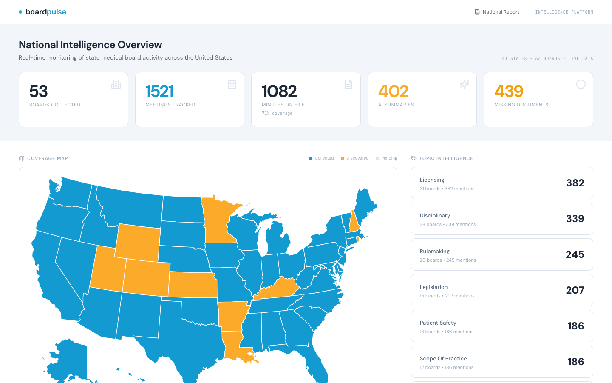
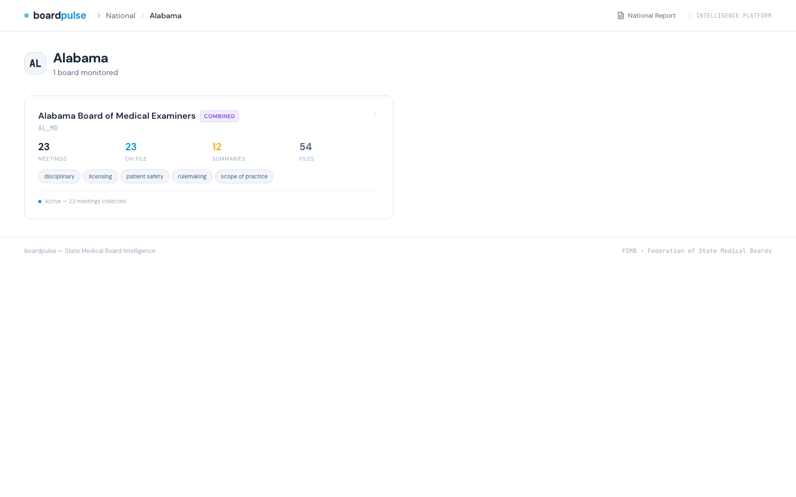
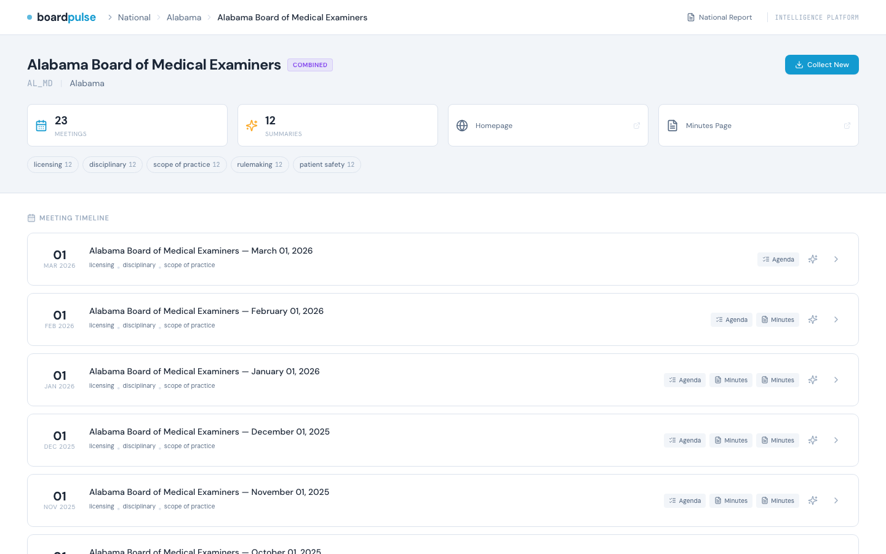
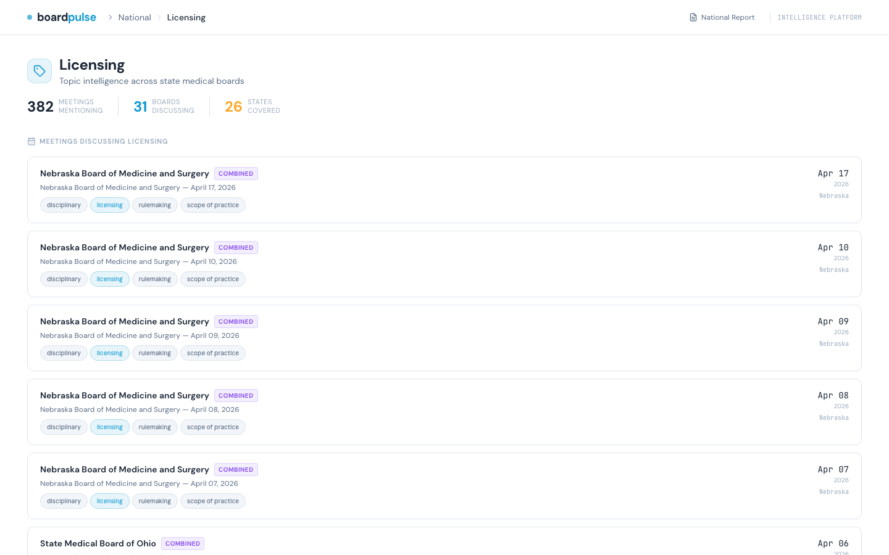
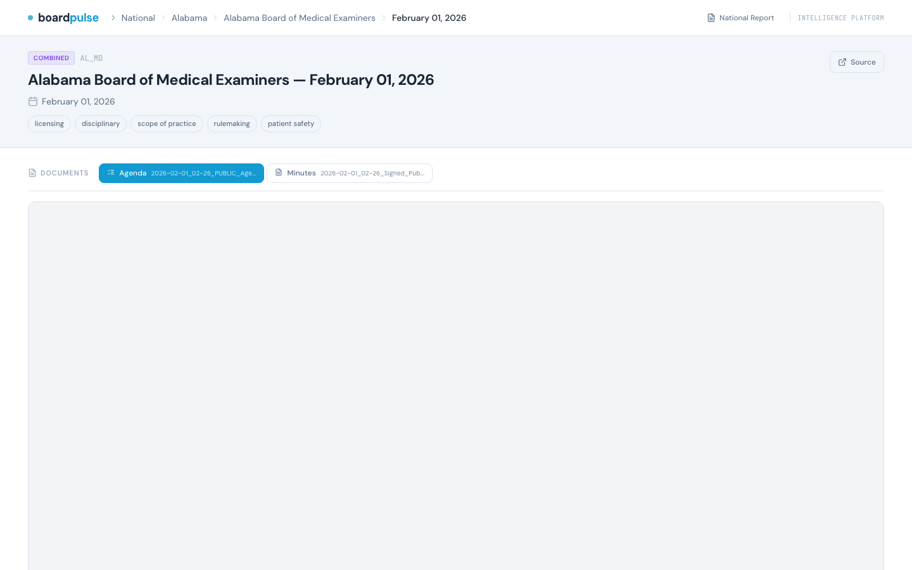

# boardpulse

**State Medical Board Intelligence Platform**

boardpulse collects, indexes, and analyzes meeting minutes from state medical boards across the United States. It downloads the actual documents (PDFs), generates AI summaries with topic tags, and presents everything through a Palantir-style drill-down intelligence interface.



## What It Does

- **Collects** meeting minutes, agendas, and documents from 63 state medical boards (51 states + DC, MD and DO boards)
- **Downloads** the actual PDF documents — not just metadata
- **Summarizes** meetings using local LLMs (Ollama) with topic tagging
- **Generates** a national landscape report with citations linking to source documents
- **Renders** exhibit pages from cited PDFs with highlighted evidence passages

## Dashboard

The web dashboard provides a drill-down intelligence interface:

**National Overview** — coverage map, topic intelligence grid, key metrics, recent activity feed

**State Drill-Down** — board cards with meeting counts, document coverage, topic breakdown



**Board Detail** — meeting timeline with document badges, expandable AI summaries



**Topic Intelligence** — cross-board analysis by topic (licensing, telehealth, AI, disciplinary, etc.)



**Meeting Detail** — embedded PDF viewer with tabbed documents, AI summary, source exhibits



## Coverage

| Metric | Count |
|--------|-------|
| Boards monitored | 63 |
| Meetings tracked | 1,500+ |
| Documents on file | 1,000+ |
| AI summaries | 400+ |
| Topics tracked | 15 |
| States covered | 46 |

## Quick Start

```bash
# Clone and set up
cd Projects/boardpulse
python -m venv venv
source venv/bin/activate
pip install -r requirements.txt
playwright install chromium

# Start the dashboard
python cli.py serve
# → http://localhost:8099

# Run collection for a specific board
python cli.py collect --board AL_MD

# Generate AI summaries (requires Ollama with gemma3:4b)
python cli.py summarize --board AL_MD

# Generate national landscape report
python cli.py summarize --national

# Recollect documents for boards missing files
python recollect_docs.py --all-missing
```

## Architecture

```
boardpulse/
├── app/
│   ├── web/              # FastAPI dashboard (Jinja2 + HTMX + Alpine.js + Tailwind)
│   │   ├── server.py     # Routes: /, /state/, /board/, /meeting/, /topic/, /report
│   │   ├── templates/    # national, state, board, meeting, topic, exhibit, report
│   │   └── static/       # CSS + US map SVG
│   ├── scraper/          # Playwright-based collectors
│   │   ├── collector.py  # Main collection pipeline
│   │   ├── boards.py     # Board seed data (63 boards)
│   │   └── discoverer.py # Minutes URL discovery
│   ├── extractor/        # AI processing
│   │   ├── summarizer.py # Ollama-powered summarization
│   │   ├── exhibits.py   # PDF page rendering with highlights
│   │   └── prompts.py    # Summary generation prompts
│   ├── models.py         # SQLAlchemy models (Board, Meeting, MeetingDocument)
│   ├── database.py       # Async SQLite (aiosqlite + WAL mode)
│   └── config.py         # Paths and settings
├── data/
│   ├── documents/        # Downloaded PDFs organized by board code
│   ├── screenshots/      # Board website screenshots
│   ├── reports/          # Generated landscape reports
│   └── exhibits/         # Rendered exhibit page images
├── cli.py                # CLI entry point
├── recollect_docs.py     # Aggressive document recollector
└── boardpulse.db         # SQLite database
```

## Tech Stack

- **Backend**: FastAPI + SQLAlchemy 2.0 + aiosqlite
- **Frontend**: Jinja2 + HTMX + Alpine.js + Tailwind CSS
- **Icons**: Lucide
- **Scraping**: Playwright (headless Chromium)
- **AI**: Ollama (gemma3:4b for summaries)
- **PDF Processing**: PyMuPDF (exhibit rendering)
- **Database**: SQLite (WAL mode)

## Topics Tracked

The AI summarization pipeline extracts and tags meetings with these topics:

`licensing` `disciplinary` `telehealth` `scope-of-practice` `rulemaking` `legislation` `opioids` `controlled-substances` `patient-safety` `physician-wellness` `AI` `CME` `IMLC` `workforce` `public-health`

## License

Internal project — FSMB Federation of State Medical Boards.
